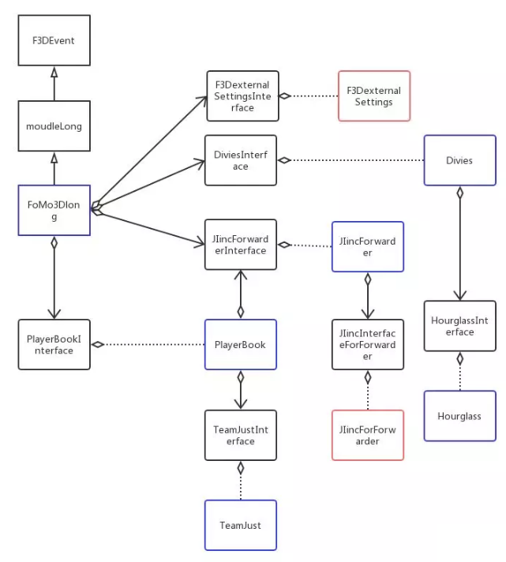

[War of attrition](https://en.wikipedia.org/wiki/War_of_attrition_(game)) game on ethereum. 

# fomo3d's contract
## relationship between contracts:
image from [wechat](https://mp.weixin.qq.com/s/kT94y3kHZKa-JXXWWGqD_A)  

## game address
[https://exitscam.me/](https://exitscam.me/getkey)

## contract on etherscan 
[etherscan link](https://etherscan.io/address/0xa62142888aba8370742be823c1782d17a0389da1#code)

## analysis articles
 - [Fomo3Dlong源码分析](https://www.jianshu.com/p/c7706ba5c005)
 
## interesting tx
1st call after contract creation: [setOtherFomo(address _otherF3D)](https://etherscan.io/tx/0x422728d092a8237a8a0544274c7268d0f1daf598c43f3e0d403c787f57a32be3) unforutnately, otherF3D contract doesn't seem open source on etherscan
